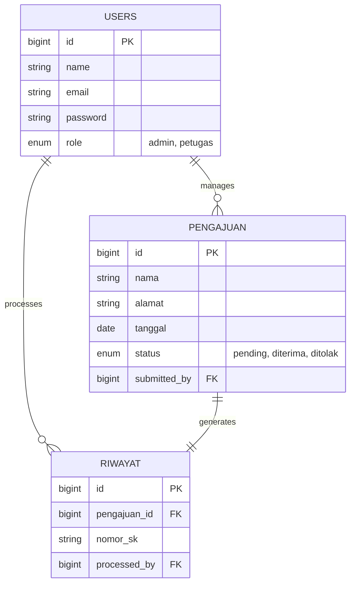

# 🏛️ Sistem Penomoran SK - Dishub Gianyar
## [Tugas Proyek Mata Kuliah: Rekayasa Perangkat Lunak (RPL)]

[](https://laravel.com)
[](https://www.docker.com/)
[](https://www.mysql.com/)
[](https://redis.io/)

Platform manajemen dan penomoran otomatis Surat Keputusan (SK) untuk **Dinas Perhubungan Kabupaten Gianyar**. Proyek ini dikembangkan sebagai implementasi praktis dari prinsip-prinsip **Software Engineering** (Rekayasa Perangkat Lunak), mencakup seluruh siklus hidup pengembangan perangkat lunak (SDLC).

---

## 📑 DAFTAR ISI

*   [📝 Deskripsi Proyek](#-deskripsi-proyek)
*   [🛠️ Teknologi yang Digunakan](#%EF%B8%8F-teknologi-yang-digunakan)
*   [📂 Struktur Direktori](#-struktur-direktori)
*   [🚀 Persiapan & Instalasi](#-persiapan--instalasi-docker)
*   [🔗 API Endpoints](#-api-endpoints)
*   [🗄️ Struktur Database](#%EF%B8%8F-struktur-database)
*   [📂 Analisis & Perancangan (UML)](#-analisis--perancangan-sistem-rpl)
*   [👥 Tim Pengembang](#-tim-pengembang-kelompok)
*   [📄 Lisensi](#-lisensi)

---

## 📝 Deskripsi Proyek

### Latar Belakang

Dinas Perhubungan Kabupaten Gianyar memerlukan sistem yang efisien untuk mengelola penomoran Surat Keputusan (SK). Sebelumnya, proses penomoran dilakukan secara manual yang rentan terhadap duplikasi nomor (human error) dan sulitnya pelacakan riwayat dokumen. Sistem ini dikembangkan untuk mendigitalisasi proses tersebut, memastikan keunikan nomor SK, dan menyediakan arsip digital yang terintegrasi.

### Tujuan Proyek

1. **Otomatisasi**: Mempercepat proses pemberian nomor SK tanpa intervensi manual yang berlebihan.
2. **Integritas Data**: Menggunakan mekanisme *database locking* untuk menjamin tidak ada nomor SK ganda (Zero Duplicate).
3. **Sentralisasi**: Menyediakan satu basis data terpusat untuk seluruh riwayat SK yang pernah dikeluarkan.
4. **Efektivitas**: Memudahkan petugas dalam mengajukan penomoran dan Admin dalam melakukan verifikasi.

### Metodologi Pengembangan (SDLC)

Proyek ini mengikuti siklus **SDLC (Software Development Life Cycle)** dengan pendekatan **Agile**:

1. **Analisis Kebutuhan**: Observasi proses penomoran SK manual di Dishub Gianyar untuk menentukan kebutuhan fungsional bagi Admin dan Petugas.
2. **Perancangan (Design)**: Pembuatan User Interface (UI), perancangan basis data (ERD), dan pemodelan sistem menggunakan UML (Use Case, Class, Activity).
3. **Implementasi**: Penulisan kode (*coding*) menggunakan Framework Laravel dengan standar PSR-12 dan pola arsitektur MVC.
4. **Pengujian (Testing)**: Melakukan Unit Testing dan Concurrency Testing untuk memastikan fitur berjalan sesuai spesifikasi dan bebas *race condition*.
5. **Deployment**: Implementasi *containerization* menggunakan Docker untuk menjamin aplikasi berjalan pada lingkungan (*environment*) yang konsisten.

### Penerapan Prinsip RPL

- **Maintainability**: Kode terstruktur rapi dengan mengikuti konvensi standar Laravel untuk memudahkan pemeliharaan jangka panjang.
- **Scalability**: Penggunaan Redis dan database locking memungkinkan sistem menangani beban request yang tinggi di masa depan.
- **Reliability**: Jaminan integritas data melalui mekanisme *database transaction* (Atomicity) pada proses pemberian nomor SK.

---

## 🛠️ Teknologi yang Digunakan

| Komponen | Teknologi | Keterangan |
| :--- | :--- | :--- |
| **Backend Framework** | Laravel 13 | PHP Web Framework |
| **Logic Language** | PHP 8.3-FPM | Server-side Scripting |
| **Database** | MySQL 8.0 | Relational Database Management System |
| **Caching & Session** | Redis 7.2 | In-memory Data Structure Store |
| **Web Server** | Nginx | High-performance Web Server |
| **Containerization** | Docker | Infrastructure as Code |
| **Asset Bundler** | Vite | Next Generation Frontend Tooling |
| **Testing** | PHPUnit | Programmer-oriented testing framework |

---

## 📂 Struktur Direktori

```text
.
├── app/                # Core Application Logic (Models, Controllers)
├── bootstrap/          # Framework Bootstrapping
├── config/             # Configuration Files
├── database/           # Migrations, Seeders, Factories
├── docker/             # Docker configuration (Nginx, PHP, Entrypoint)
├── public/             # Static Assets & Entry Point
├── resources/          # Templates (Blade), CSS, JS
├── routes/             # Route Definitions (web, auth)
├── storage/            # Logs, Compiled Templates, File Uploads
├── tests/              # Automated Tests
├── Dockerfile          # App Docker Image Definition
├── docker-compose.yml  # Multi-container orchestration
├── Makefile            # Project Shortcuts
└── README.md           # Project Documentation
```

---

## 🚀 Persiapan & Instalasi (Docker)

Pastikan Anda sudah menginstal **Docker** dan **Docker Compose** di sistem Anda.

### 1. Clone Repositori

```bash
git clone https://github.com/dodepunia2002/sistem-penomoran-sk.git
cd sistem-penomoran-sk-laravel
```

### 2. Setup Environment

```bash
cp .env.docker .env
```

### 3. Jalankan Docker Stack

Gunakan perintah `make` untuk kemudahan:

```bash
make up         # Menjalankan container di background
make key        # Generate Application Key
make migrate    # Menjalankan migrasi database
make seed       # Mengisi data awal (Admin & Petugas)
```

### 4. Akses Aplikasi

Buka browser dan akses: <http://localhost>

---

## 🔗 API Endpoints

### 🔐 Authentication
| Method | Endpoint | Admin | Petugas | Deskripsi |
| :--- | :--- | :---: | :---: | :--- |
| POST | `/login` | ✅ | ✅ | Masuk ke sistem |
| POST | `/logout` | ✅ | ✅ | Keluar dari sistem |
| GET | `/register` | ❌ | ❌ | Pendaftaran akun (Disabled) |

### 👑 Admin Routes (Prefix: `/admin`)
| Method | Endpoint | Deskripsi |
| :--- | :--- | :--- |
| GET | `/` | Dashboard Statistik (Real-time) |
| GET | `/pemberian-nomor` | Daftar antrian pengajuan nomor SK |
| POST | `/pengajuan/{id}/terima` | Proses verifikasi dan pemberian nomor |
| POST | `/pengajuan/{id}/tolak` | Menolak pengajuan |
| GET | `/riwayat` | Daftar riwayat seluruh penomoran |
| GET | `/manajemen-user` | Kelola data Admin/Petugas |

### 👮 Petugas Routes (Prefix: `/petugas`)
| Method | Endpoint | Deskripsi |
| :--- | :--- | :--- |
| GET | `/` | Dashboard Personal |
| GET | `/input-data` | Form pengajuan nomor SK baru |
| POST | `/pengajuan` | Simpan data pengajuan |
| GET | `/riwayat` | Daftar pengajuan milik sendiri |

---

## 🗄️ Struktur Database

### Table: `users`
| Column | Type | Nullable | Description |
| :--- | :--- | :---: | :--- |
| id | bigint (PK) | No | Unique User ID |
| name | string | No | Full Name |
| email | string | No | Unique Email |
| password | string | No | Hashed Password |
| role | enum | No | 'admin', 'petugas' |

### Table: `pengajuan`
| Column | Type | Nullable | Description |
| :--- | :--- | :---: | :--- |
| id | bigint (PK) | No | Record ID |
| nama | string | No | Nama Lokasi/Instansi |
| alamat | string | No | Alamat Lengkap |
| tanggal | string | No | Tanggal Pengajuan |
| status | enum | No | 'pending', 'diterima', 'ditolak' |
| submitted_by | bigint (FK) | No | User who created |

---

## 📂 Analisis & Perancangan Sistem (RPL)

<details>
<summary><b>📐 View Use Case Diagram</b></summary>

```mermaid
usecaseDiagram
    actor "Admin" as A
    actor "Petugas" as P

    package "Sistem Penomoran SK" {
        usecase "Login & Logout" as UC1
        usecase "Monitoring Dashboard" as UC2
        usecase "Input Pengajuan SK" as UC3
        usecase "Verifikasi & Penomoran SK" as UC4
        usecase "Manajemen Riwayat" as UC5
        usecase "Manajemen User" as UC6
    }

    P --> UC1
    P --> UC2
    P --> UC3
    
    A --> UC1
    A --> UC2
    A --> UC4
    A --> UC5
    A --> UC6
```
</details>

<details>
<summary><b>🗃️ View Entity Relationship Diagram (ERD)</b></summary>


</details>

<details>
<summary><b>⚙️ View Activity Diagram (Proses Verifikasi)</b></summary>

```mermaid
activityDiagram
    start
    :Admin memilih Pengajuan Pending;
    if (Keputusan?) then (Terima)
        :Sistem memulai Database Transaction;
        :Lock baris data (Pessimistic Locking);
        :Hitung jumlah SK bulan ini + 1;
        :Generate Nomor SK (SK/MM/XXXX/YYYY);
        :Update status Pengajuan ke 'diterima';
        :Simpan ke tabel Riwayat;
        :Commit Transaction;
        :Tampilkan Notifikasi Berhasil;
    else (Tolak)
        :Update status Pengajuan ke 'ditolak';
        :Tampilkan Notifikasi Penolakan;
    end
    stop
```
</details>

---

## 👥 Tim Pengembang (Kelompok)

Proyek ini dikembangkan oleh kelompok mahasiswa untuk tugas mata kuliah **Rekayasa Perangkat Lunak (RPL)**:

| Nama Lengkap | NIM | Peran Utama |
| :--- | :--- | :--- |
| **[Nama Ketua/Anda]** | [NIM Lengkap] | Project Manager & DevOps Engineering |
| **[Anggota 2]** | [NIM Lengkap] | Frontend Developer & UI/UX Designer |
| **[Anggota 3]** | [NIM Lengkap] | Backend Developer & Database Analyst |
| **[Anggota 4]** | [NIM Lengkap] | System Analyst & Technical Writer |

---

## 📄 Lisensi

Sistem ini bersifat open-source dan berada di bawah lisensi [MIT](LICENSE).

---

Dibuat dengan ❤️ untuk Dinas Perhubungan Kabupaten Gianyar
