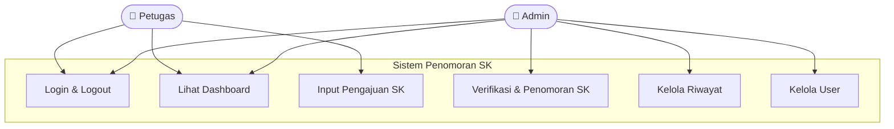
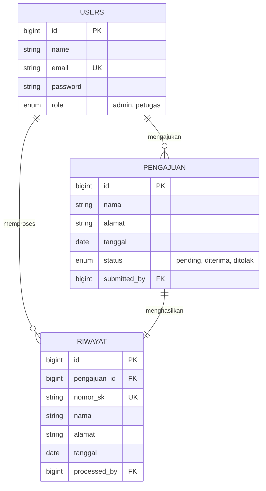
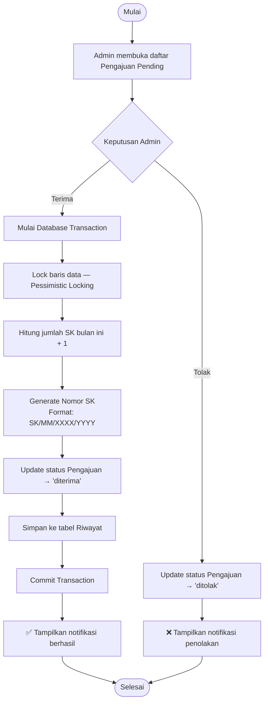
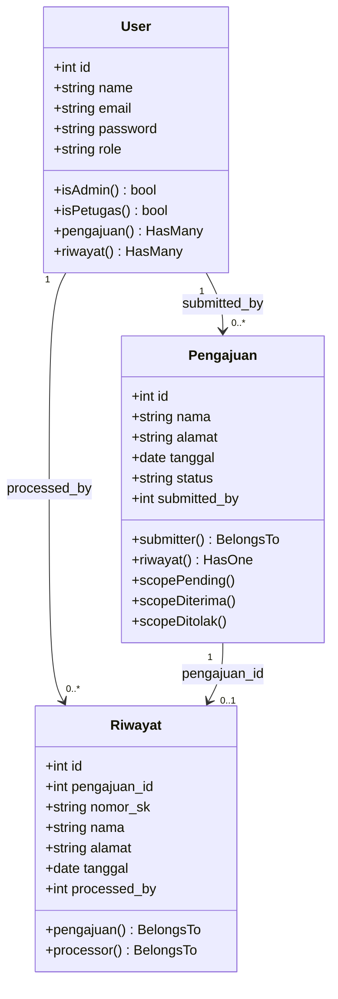

# 🏛️ Sistem Penomoran SK — Dishub Gianyar

> **Tugas Proyek Mata Kuliah: Rekayasa Perangkat Lunak (RPL)**

[](https://laravel.com)
[](https://www.php.net)
[](https://www.docker.com)
[](https://www.mysql.com)
[](https://redis.io)
[](LICENSE)

Platform manajemen dan penomoran otomatis **Surat Keputusan (SK)** untuk **Dinas Perhubungan Kabupaten Gianyar**. Dibangun dengan Laravel, MySQL, Redis, dan Docker sebagai implementasi praktis prinsip *Software Engineering* (SDLC Agile).

---

## 📑 Daftar Isi

- [📝 Deskripsi Proyek](#-deskripsi-proyek)
- [🛠️ Teknologi](#️-teknologi)
- [📂 Struktur Direktori](#-struktur-direktori)
- [🚀 Instalasi & Menjalankan](#-instalasi--menjalankan)
- [🔗 Endpoint Aplikasi](#-endpoint-aplikasi)
- [🗄️ Struktur Database](#️-struktur-database)
- [📐 Analisis & Perancangan (UML)](#-analisis--perancangan-uml)
- [👥 Tim Pengembang](#-tim-pengembang)
- [📄 Lisensi](#-lisensi)

---

## 📝 Deskripsi Proyek

### Latar Belakang

Dinas Perhubungan Kabupaten Gianyar memerlukan sistem yang efisien untuk mengelola penomoran Surat Keputusan (SK). Proses manual sebelumnya rentan terhadap duplikasi nomor (*human error*) dan sulitnya pelacakan riwayat dokumen.

### Tujuan

| # | Tujuan | Keterangan |
|---|--------|------------|
| 1 | **Otomatisasi** | Pemberian nomor SK tanpa intervensi manual |
| 2 | **Integritas Data** | Database locking untuk mencegah nomor SK ganda |
| 3 | **Sentralisasi** | Satu basis data terpusat untuk seluruh riwayat SK |
| 4 | **Efektivitas** | Alur pengajuan → verifikasi yang streamlined |

### Metodologi (SDLC Agile)

1. **Analisis Kebutuhan** — Identifikasi kebutuhan fungsional Admin & Petugas
2. **Perancangan** — UI design, ERD, dan pemodelan UML (Use Case, Class, Activity)
3. **Implementasi** — Laravel MVC, PSR-12, database transactions
4. **Pengujian** — Unit Testing & Concurrency Testing
5. **Deployment** — Containerization menggunakan Docker

---

## 🛠️ Teknologi

| Komponen | Teknologi | Versi |
|:---------|:----------|:------|
| Backend Framework | Laravel | 12.x |
| Runtime | PHP-FPM Alpine | 8.4 |
| Database | MySQL | 8.0 |
| Cache & Session | Redis | 7 |
| Web Server | Nginx | 1.25 |
| Containerization | Docker Compose | v2 |
| Asset Bundler | Vite + Tailwind | Latest |

---

## 📂 Struktur Direktori

```text
sistem-penomoran-sk/
├── app/
│   ├── Http/
│   │   ├── Controllers/      # DashboardController, PengajuanController, dst.
│   │   ├── Middleware/        # RoleMiddleware (admin/petugas RBAC)
│   │   └── Requests/          # Form validation (StorePengajuanRequest)
│   ├── Models/                # User, Pengajuan, Riwayat
│   └── View/Components/       # AppLayout, GuestLayout
├── database/
│   ├── migrations/            # Schema & indexes
│   └── seeders/               # Admin & Petugas default accounts
├── docker/
│   ├── nginx/default.conf     # Nginx virtual host
│   └── php/
│       ├── entrypoint.sh      # Startup script (migrate, seed, cache)
│       └── php.ini            # PHP tuning
├── resources/views/
│   ├── admin/                 # Dashboard, pemberian-nomor, riwayat, manajemen-user
│   ├── petugas/               # Dashboard, input-data, riwayat
│   ├── layouts/app.blade.php  # Master layout (sidebar + auth)
│   └── landing.blade.php      # Halaman publik
├── routes/
│   ├── web.php                # Route utama (admin & petugas)
│   └── auth.php               # Breeze auth routes
├── .env.example               # Template env (lokal / SQLite)
├── .env.docker                # Template env (Docker / MySQL + Redis)
├── docker-compose.yml         # Orchestration: app, nginx, mysql, redis
├── Dockerfile                 # Multi-stage build (Node + PHP-FPM)
└── Makefile                   # Shortcut commands
```

---

## 🚀 Instalasi & Menjalankan

### Prasyarat

- [Docker Desktop](https://www.docker.com/products/docker-desktop) (termasuk Docker Compose v2)
- Git

### Langkah Instalasi

**1. Clone repositori**

```bash
git clone https://github.com/dodepunia2002/sistem-penomoran-sk.git
cd sistem-penomoran-sk
```

**2. Siapkan file environment**

```bash
cp .env.docker .env
```

> File `.env.docker` sudah dikonfigurasi untuk Docker (MySQL + Redis).
> `APP_KEY` akan di-generate otomatis saat container pertama kali start.

**3. Build & jalankan Docker**

```bash
docker compose up -d --build
```

**4. Buka aplikasi**

```
http://localhost
```

### Akun Default

| Role | Email | Password |
|------|-------|----------|
| Admin | `admin@dishub.go.id` | `admin123` |
| Petugas | `petugas@dishub.go.id` | `petugas123` |

### Perintah Makefile (Shortcut)

```bash
make help        # Tampilkan semua perintah
make up          # Start containers
make down        # Stop containers
make logs-app    # Lihat log app
make migrate     # Jalankan migrasi
make seed        # Seed database
make fresh       # Reset database (⚠️ hapus semua data)
make shell       # Masuk terminal container
make test        # Jalankan unit test
```

---

## 🔗 Endpoint Aplikasi

### Autentikasi

| Method | URL | Keterangan |
|--------|-----|------------|
| `GET` | `/` | Landing page publik |
| `GET` | `/login` | Halaman login |
| `POST` | `/login` | Proses autentikasi |
| `POST` | `/logout` | Logout |

### Admin (`/admin/*`)

| Method | URL | Keterangan |
|--------|-----|------------|
| `GET` | `/admin` | Dashboard statistik |
| `GET` | `/admin/pemberian-nomor` | Antrian pengajuan SK |
| `POST` | `/admin/pengajuan/{id}/terima` | Terima & beri nomor SK |
| `POST` | `/admin/pengajuan/{id}/tolak` | Tolak pengajuan |
| `GET` | `/admin/riwayat` | Riwayat semua penomoran |
| `GET` | `/admin/manajemen-user` | Kelola pengguna |
| `POST` | `/admin/users` | Tambah pengguna baru |
| `PUT` | `/admin/users/{id}` | Update pengguna |
| `DELETE` | `/admin/users/{id}` | Hapus pengguna |

### Petugas (`/petugas/*`)

| Method | URL | Keterangan |
|--------|-----|------------|
| `GET` | `/petugas` | Dashboard personal |
| `GET` | `/petugas/input-data` | Form pengajuan baru |
| `POST` | `/petugas/pengajuan` | Simpan pengajuan |
| `GET` | `/petugas/riwayat` | Riwayat pengajuan sendiri |
| `PUT` | `/petugas/pengajuan/{id}` | Edit pengajuan (status: pending) |
| `DELETE` | `/petugas/pengajuan/{id}` | Hapus pengajuan (status: pending) |

---

## 🗄️ Struktur Database

### Tabel `users`

| Kolom | Tipe | Keterangan |
|-------|------|------------|
| `id` | bigint PK | Auto-increment |
| `name` | varchar(255) | Nama lengkap |
| `email` | varchar(255) UNIQUE | Email login |
| `password` | varchar(255) | Bcrypt hash |
| `role` | enum('admin','petugas') | Hak akses |
| `created_at` | timestamp | — |
| `updated_at` | timestamp | — |

### Tabel `pengajuan`

| Kolom | Tipe | Keterangan |
|-------|------|------------|
| `id` | bigint PK | Auto-increment |
| `nama` | varchar(255) | Nama lokasi/instansi |
| `alamat` | varchar(500) | Alamat lengkap |
| `tanggal` | date | Tanggal pengajuan |
| `status` | enum('pending','diterima','ditolak') | Default: pending |
| `submitted_by` | bigint FK → users | Petugas pengaju |

### Tabel `riwayat`

| Kolom | Tipe | Keterangan |
|-------|------|------------|
| `id` | bigint PK | Auto-increment |
| `pengajuan_id` | bigint FK → pengajuan | Relasi pengajuan |
| `nama` | varchar(255) | Snapshot nama |
| `alamat` | varchar(500) | Snapshot alamat |
| `tanggal` | date | Snapshot tanggal |
| `nomor_sk` | varchar(255) UNIQUE | Format: `SK/MM/XXXX/YYYY` |
| `processed_by` | bigint FK → users | Admin pemroses |

---

## 📐 Analisis & Perancangan (UML)

### Use Case Diagram



### Entity Relationship Diagram (ERD)



### Activity Diagram — Proses Verifikasi SK



### Class Diagram



---

## 👥 Tim Pengembang

Dikembangkan oleh mahasiswa **Rekayasa Perangkat Lunak (RPL)** — STIKOM Bali:

| Nama | NIM | Peran |
|:-----|:----|:------|
| I Dewa Gede Punia Atmaja | 220030750 | Project Manager & DevOps |
| I Wayan Pandya Aryasuta Putra Gama | 220030770 | Frontend Developer & UI/UX |
| Muhammad Abbas Syah | 240030361 | Backend Developer & Database |

---

## 📄 Lisensi

Proyek ini bersifat open-source di bawah lisensi **[MIT](LICENSE)**.

---

<p align="center">Dibuat dengan ❤️ untuk <strong>Dinas Perhubungan Kabupaten Gianyar</strong></p>
