# 📋 Sistem Penomoran Surat Keputusan (SK)
## Dinas Perhubungan Kabupaten Gianyar

Aplikasi web full-stack untuk mengelola **penomoran Surat Keputusan (SK)** di lingkungan Dinas Perhubungan Kabupaten Gianyar. Sistem ini memfasilitasi alur kerja pengajuan dan pemberian nomor SK secara digital, menggantikan proses manual yang kurang efisien.

---

## 📑 Daftar Isi

- [Latar Belakang](#-latar-belakang)
- [Fitur Utama](#-fitur-utama)
- [Teknologi yang Digunakan](#-teknologi-yang-digunakan)
- [Arsitektur Sistem](#-arsitektur-sistem)
- [Entity Relationship Diagram (ERD)](#-entity-relationship-diagram-erd)
- [Data Flow Diagram (DFD)](#-data-flow-diagram-dfd)
- [Use Case Diagram](#-use-case-diagram)
- [Activity Diagram](#-activity-diagram)
- [Sequence Diagram](#-sequence-diagram)
- [Class Diagram](#-class-diagram)
- [Flowchart Sistem](#-flowchart-sistem)
- [Struktur Database](#-struktur-database)
- [API Endpoint](#-api-endpoint)
- [Struktur Direktori](#-struktur-direktori)
- [Cara Instalasi & Menjalankan](#-cara-instalasi--menjalankan)
- [Screenshot Aplikasi](#-screenshot-aplikasi)

---

## 📖 Latar Belakang

Dinas Perhubungan Kabupaten Gianyar memerlukan sistem informasi untuk mengelola penomoran Surat Keputusan (SK) yang selama ini dilakukan secara manual. Proses manual menyebabkan:

- **Duplikasi nomor SK** yang tidak terdeteksi
- **Kesulitan dalam pelacakan** riwayat penomoran
- **Lambatnya proses verifikasi** oleh admin

Sistem ini dibangun sebagai solusi digital yang memungkinkan petugas mengajukan permintaan nomor SK secara online, dan admin dapat memverifikasi serta memberikan nomor SK secara otomatis.

---

## ✨ Fitur Utama

### 🔐 Autentikasi & Otorisasi
- Login dengan JWT (JSON Web Token)
- Role-based access control (Admin & Petugas)
- Session management dengan auto-verification

### 👨‍💼 Fitur Admin
- **Pemberian Nomor SK** — Verifikasi dan pemberian nomor SK otomatis
- **Riwayat Penomoran** — Melihat, mencari, mengedit, dan menghapus data SK
- **Manajemen User** — CRUD akun pengguna (admin/petugas)

### 👷 Fitur Petugas
- **Input Data Pengajuan** — Mengajukan permintaan nomor SK baru
- **Riwayat Pengajuan** — Melihat status pengajuan (pending/diterima/ditolak)

---

## 🛠 Teknologi yang Digunakan

| Layer | Teknologi | Keterangan |
|---|---|---|
| **Frontend** | React 19 + Vite | Single Page Application (SPA) |
| **Backend** | Express.js | RESTful API Server |
| **Database** | SQLite (better-sqlite3) | Database relasional lokal |
| **Autentikasi** | JWT + bcryptjs | JSON Web Token & Password Hashing |
| **Styling** | Vanilla CSS | Custom styling tanpa framework CSS |
| **Icons** | Lucide React | Icon library modern |

---

## 🏗 Arsitektur Sistem

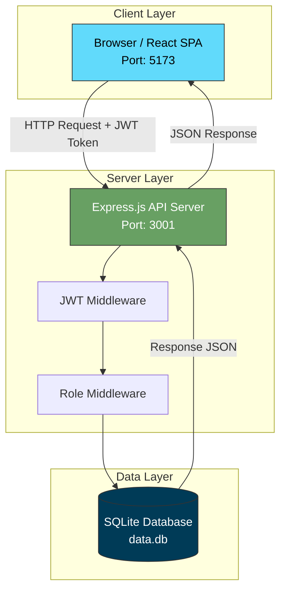
```mermaid
graph TB
    subgraph "Client Layer"
        A[Browser / React SPA<br/>Port: 5173]
    end

    subgraph "Server Layer"
        B[Express.js API Server<br/>Port: 3001]
        C[JWT Middleware]
        D[Role Middleware]
    end

    subgraph "Data Layer"
        E[(SQLite Database<br/>data.db)]
    end

    A -->|HTTP Request + JWT Token| B
    B --> C
    C --> D
    D --> E
    E -->|Response JSON| B
    B -->|JSON Response| A

    style A fill:#61dafb,stroke:#333,color:#000
    style B fill:#68a063,stroke:#333,color:#fff
    style E fill:#003b57,stroke:#333,color:#fff
```

---

## 📊 Entity Relationship Diagram (ERD)

> 📎 **File:** [ERD.drawio](docs/diagrams/ERD.drawio) | [ERD.png](docs/diagrams/ERD.png)

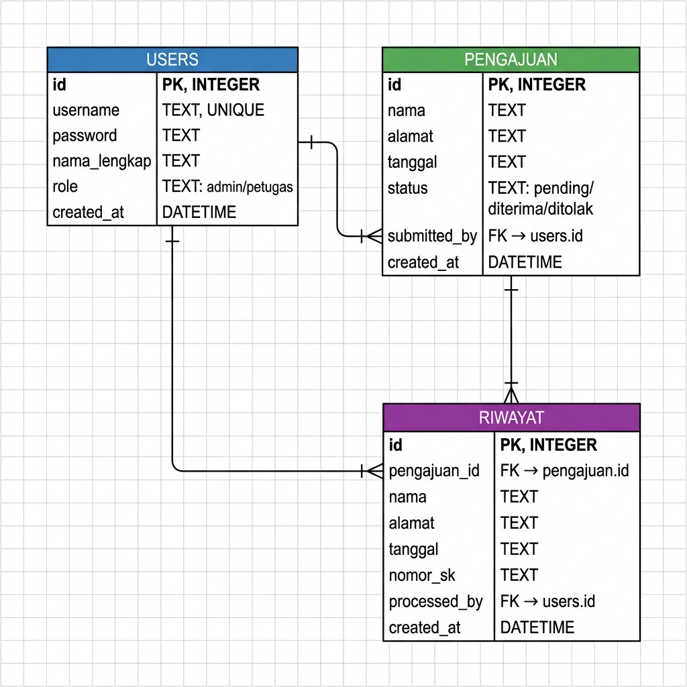

<details>
<summary>📐 Kode Mermaid (klik untuk melihat)</summary>

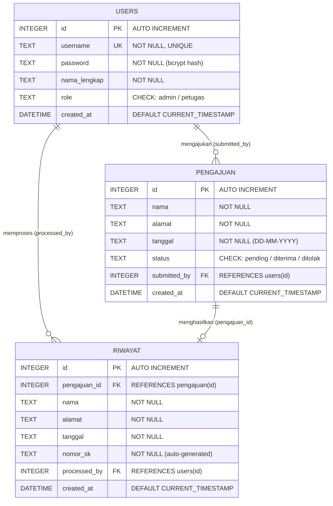
```mermaid
erDiagram
    USERS {
        INTEGER id PK "AUTO INCREMENT"
        TEXT username UK "NOT NULL, UNIQUE"
        TEXT password "NOT NULL (bcrypt hash)"
        TEXT nama_lengkap "NOT NULL"
        TEXT role "CHECK: admin / petugas"
        DATETIME created_at "DEFAULT CURRENT_TIMESTAMP"
    }

    PENGAJUAN {
        INTEGER id PK "AUTO INCREMENT"
        TEXT nama "NOT NULL"
        TEXT alamat "NOT NULL"
        TEXT tanggal "NOT NULL (DD-MM-YYYY)"
        TEXT status "CHECK: pending / diterima / ditolak"
        INTEGER submitted_by FK "REFERENCES users(id)"
        DATETIME created_at "DEFAULT CURRENT_TIMESTAMP"
    }

    RIWAYAT {
        INTEGER id PK "AUTO INCREMENT"
        INTEGER pengajuan_id FK "REFERENCES pengajuan(id)"
        TEXT nama "NOT NULL"
        TEXT alamat "NOT NULL"
        TEXT tanggal "NOT NULL"
        TEXT nomor_sk "NOT NULL (auto-generated)"
        INTEGER processed_by FK "REFERENCES users(id)"
        DATETIME created_at "DEFAULT CURRENT_TIMESTAMP"
    }

    USERS ||--o{ PENGAJUAN : "mengajukan (submitted_by)"
    USERS ||--o{ RIWAYAT : "memproses (processed_by)"
    PENGAJUAN ||--o| RIWAYAT : "menghasilkan (pengajuan_id)"
```

</details>

---

## 🔄 Data Flow Diagram (DFD)

> 📎 **File:** [DFD.drawio](docs/diagrams/DFD.drawio) | [DFD-Level-0.png](docs/diagrams/DFD-Level-0.png) | [DFD-Level-1.png](docs/diagrams/DFD-Level-1.png)

### DFD Level 0 (Context Diagram)

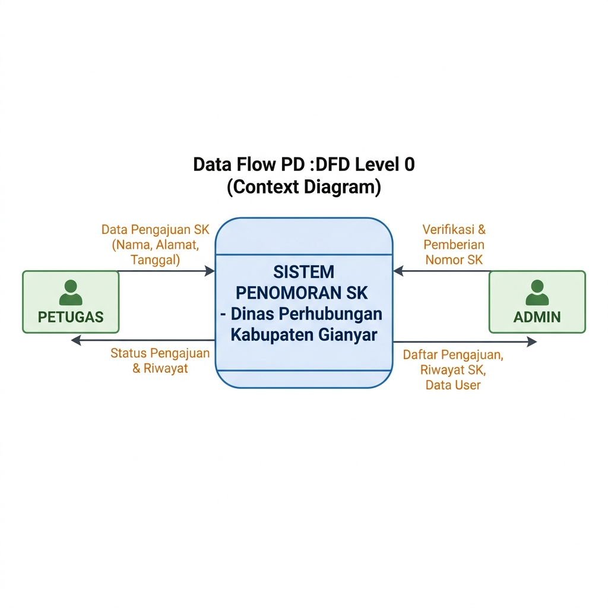

<details>
<summary>📐 Kode Mermaid</summary>

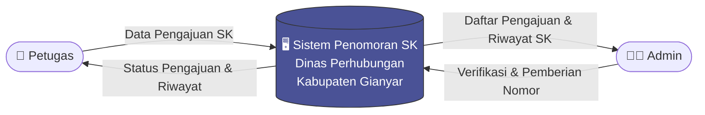
```mermaid
graph LR
    PETUGAS([👷 Petugas]) -->|Data Pengajuan SK| SISTEM[("🖥 Sistem Penomoran SK<br/>Dinas Perhubungan<br/>Kabupaten Gianyar")]
    SISTEM -->|Status Pengajuan & Riwayat| PETUGAS

    ADMIN([👨‍💼 Admin]) -->|Verifikasi & Pemberian Nomor| SISTEM
    SISTEM -->|Daftar Pengajuan & Riwayat SK| ADMIN

    style SISTEM fill:#4a5296,stroke:#333,color:#fff
```

</details>

### DFD Level 1

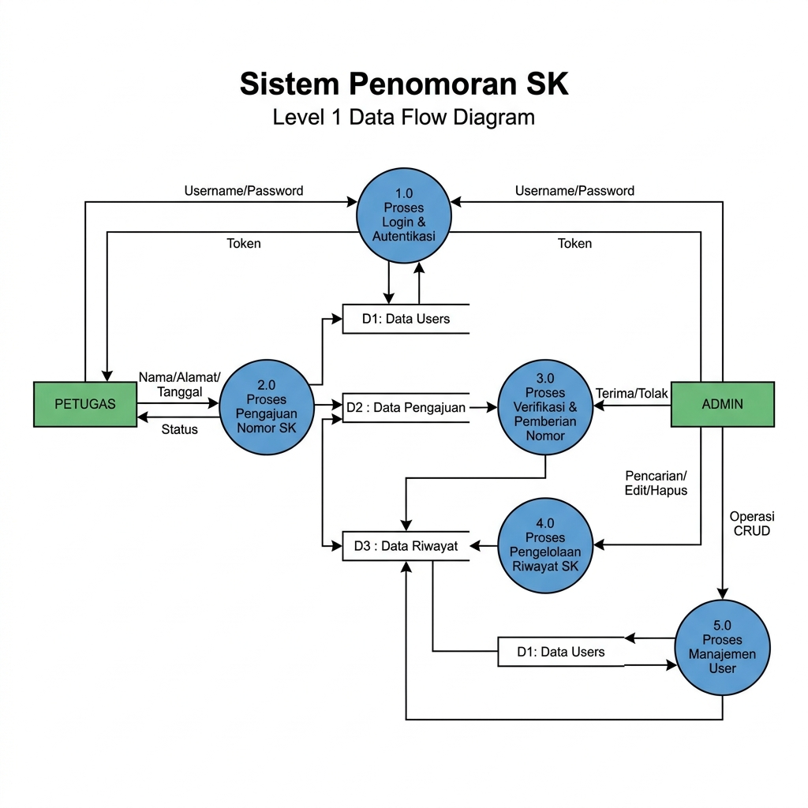

<details>
<summary>📐 Kode Mermaid</summary>

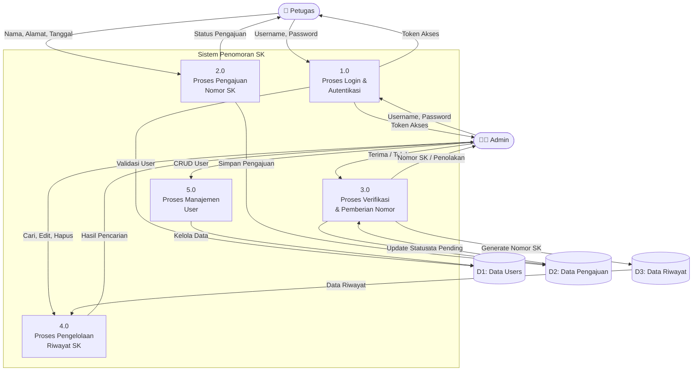
```mermaid
graph TB
    PETUGAS([👷 Petugas])
    ADMIN([👨‍💼 Admin])

    subgraph "Sistem Penomoran SK"
        P1["1.0<br/>Proses Login &<br/>Autentikasi"]
        P2["2.0<br/>Proses Pengajuan<br/>Nomor SK"]
        P3["3.0<br/>Proses Verifikasi<br/>& Pemberian Nomor"]
        P4["4.0<br/>Proses Pengelolaan<br/>Riwayat SK"]
        P5["5.0<br/>Proses Manajemen<br/>User"]
    end

    DS1[(D1: Data Users)]
    DS2[(D2: Data Pengajuan)]
    DS3[(D3: Data Riwayat)]

    PETUGAS -->|Username, Password| P1
    ADMIN -->|Username, Password| P1
    P1 -->|Validasi User| DS1
    P1 -->|Token Akses| PETUGAS
    P1 -->|Token Akses| ADMIN

    PETUGAS -->|Nama, Alamat, Tanggal| P2
    P2 -->|Simpan Pengajuan| DS2
    P2 -->|Status Pengajuan| PETUGAS

    ADMIN -->|Terima / Tolak| P3
    DS2 -->|Data Pending| P3
    P3 -->|Update Status| DS2
    P3 -->|Generate Nomor SK| DS3
    P3 -->|Nomor SK / Penolakan| ADMIN

    ADMIN -->|Cari, Edit, Hapus| P4
    DS3 -->|Data Riwayat| P4
    P4 -->|Hasil Pencarian| ADMIN

    ADMIN -->|CRUD User| P5
    P5 -->|Kelola Data| DS1
```

### DFD Level 2 — Proses 3.0 (Verifikasi & Pemberian Nomor)

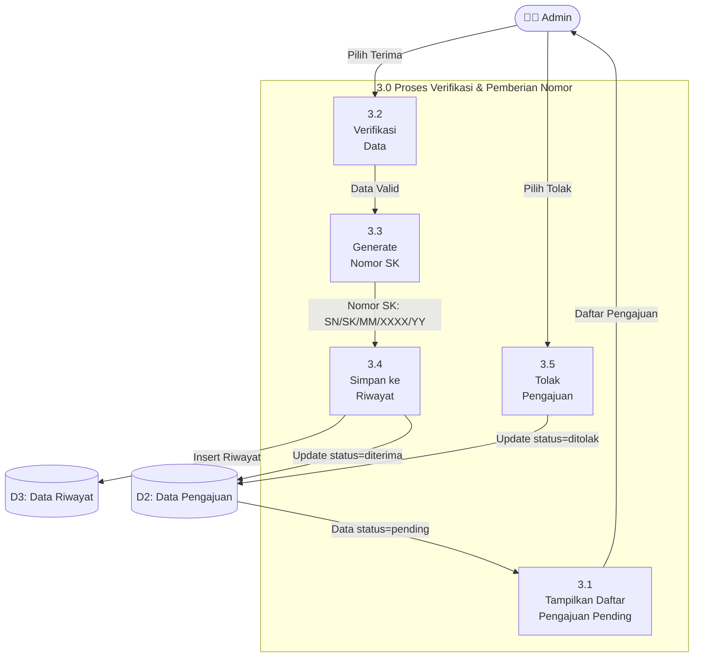
```mermaid
graph TB
    ADMIN([👨‍💼 Admin])
    DS2[(D2: Data Pengajuan)]
    DS3[(D3: Data Riwayat)]

    subgraph "3.0 Proses Verifikasi & Pemberian Nomor"
        P31["3.1<br/>Tampilkan Daftar<br/>Pengajuan Pending"]
        P32["3.2<br/>Verifikasi<br/>Data"]
        P33["3.3<br/>Generate<br/>Nomor SK"]
        P34["3.4<br/>Simpan ke<br/>Riwayat"]
        P35["3.5<br/>Tolak<br/>Pengajuan"]
    end

    DS2 -->|Data status=pending| P31
    P31 -->|Daftar Pengajuan| ADMIN
    ADMIN -->|Pilih Terima| P32
    ADMIN -->|Pilih Tolak| P35
    P32 -->|Data Valid| P33
    P33 -->|Nomor SK: SN/SK/MM/XXXX/YY| P34
    P34 -->|Insert Riwayat| DS3
    P34 -->|Update status=diterima| DS2
    P35 -->|Update status=ditolak| DS2
```

</details>

---

## 🎯 Use Case Diagram

> 📎 **File:** [Use-Case-Diagram.drawio](docs/diagrams/Use-Case-Diagram.drawio) | [Use-Case-Diagram.png](docs/diagrams/Use-Case-Diagram.png)

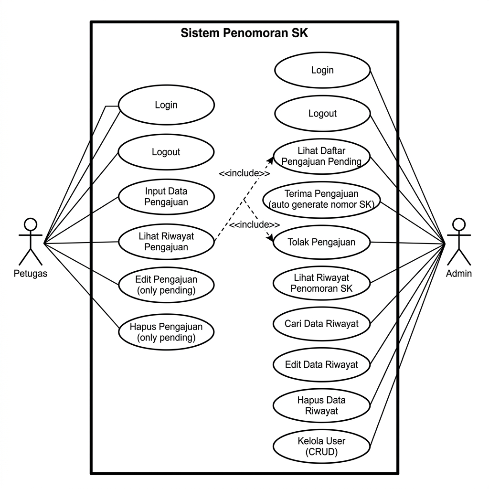

<details>
<summary>📐 Kode Mermaid</summary>

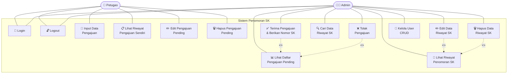
```mermaid
graph TB
    subgraph "Sistem Penomoran SK"
        UC1["🔑 Login"]
        UC2["🔓 Logout"]

        UC3["📝 Input Data<br/>Pengajuan"]
        UC4["📋 Lihat Riwayat<br/>Pengajuan Sendiri"]
        UC5["✏️ Edit Pengajuan<br/>Pending"]
        UC6["🗑️ Hapus Pengajuan<br/>Pending"]

        UC7["📊 Lihat Daftar<br/>Pengajuan Pending"]
        UC8["✅ Terima Pengajuan<br/>& Berikan Nomor SK"]
        UC9["❌ Tolak<br/>Pengajuan"]
        UC10["📜 Lihat Riwayat<br/>Penomoran SK"]
        UC11["🔍 Cari Data<br/>Riwayat SK"]
        UC12["✏️ Edit Data<br/>Riwayat SK"]
        UC13["🗑️ Hapus Data<br/>Riwayat SK"]
        UC14["👥 Kelola User<br/>CRUD"]
    end

    PETUGAS([👷 Petugas])
    ADMIN([👨‍💼 Admin])

    PETUGAS --- UC1
    PETUGAS --- UC2
    PETUGAS --- UC3
    PETUGAS --- UC4
    PETUGAS --- UC5
    PETUGAS --- UC6

    ADMIN --- UC1
    ADMIN --- UC2
    ADMIN --- UC7
    ADMIN --- UC8
    ADMIN --- UC9
    ADMIN --- UC10
    ADMIN --- UC11
    ADMIN --- UC12
    ADMIN --- UC13
    ADMIN --- UC14

    UC8 -.->|"<<include>>"| UC7
    UC9 -.->|"<<include>>"| UC7
    UC12 -.->|"<<include>>"| UC10
    UC13 -.->|"<<include>>"| UC10
```

```

</details>

---

## 📈 Activity Diagram

> 📎 **File:** [Activity-Diagram.drawio](docs/diagrams/Activity-Diagram.drawio) | [Activity-Diagram.png](docs/diagrams/Activity-Diagram.png)

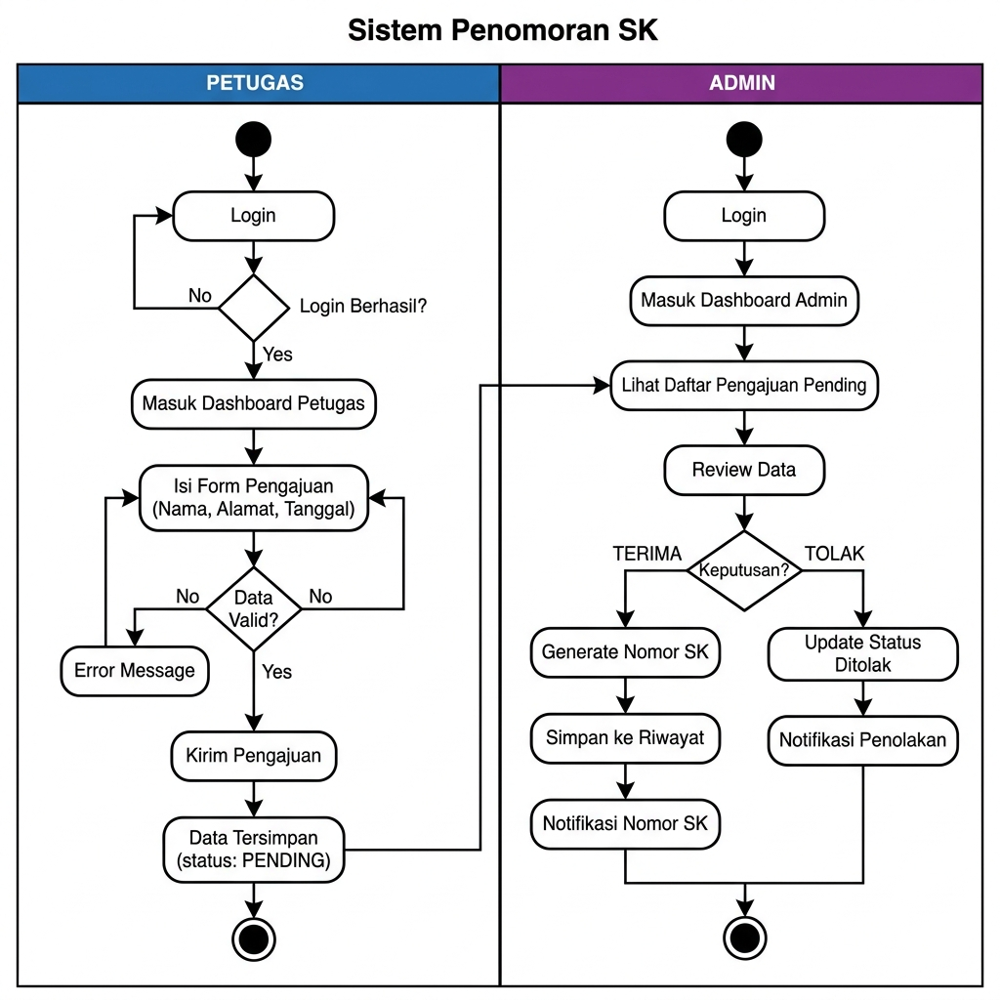

<details>
<summary>📐 Kode Mermaid</summary>

### Activity Diagram — Pengajuan Nomor SK oleh Petugas

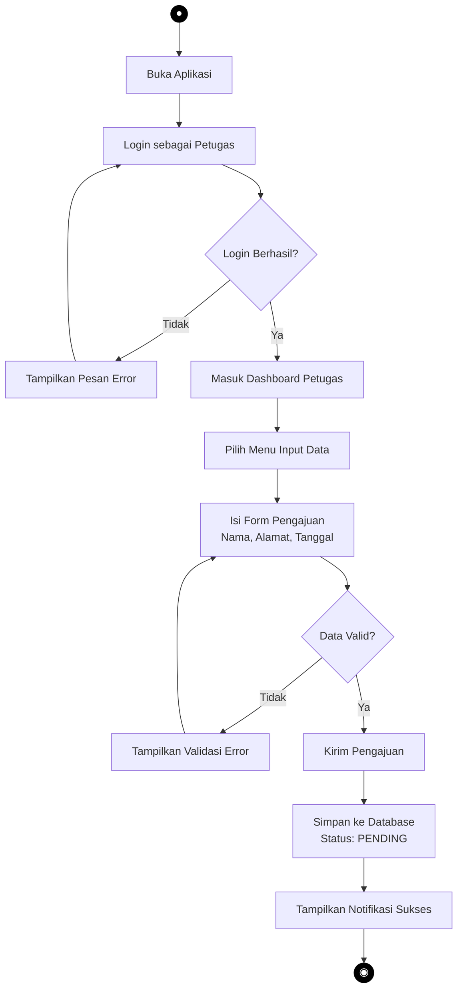
```mermaid
flowchart TD
    START((●)) --> A[Buka Aplikasi]
    A --> B[Login sebagai Petugas]
    B --> C{Login Berhasil?}
    C -->|Tidak| D[Tampilkan Pesan Error]
    D --> B
    C -->|Ya| E[Masuk Dashboard Petugas]
    E --> F[Pilih Menu Input Data]
    F --> G[Isi Form Pengajuan<br/>Nama, Alamat, Tanggal]
    G --> H{Data Valid?}
    H -->|Tidak| I[Tampilkan Validasi Error]
    I --> G
    H -->|Ya| J[Kirim Pengajuan]
    J --> K[Simpan ke Database<br/>Status: PENDING]
    K --> L[Tampilkan Notifikasi Sukses]
    L --> FINISH((◉))

    style START fill:#000,stroke:#000,color:#fff
    style FINISH fill:#000,stroke:#000,color:#fff
```

### Activity Diagram — Verifikasi Pengajuan oleh Admin

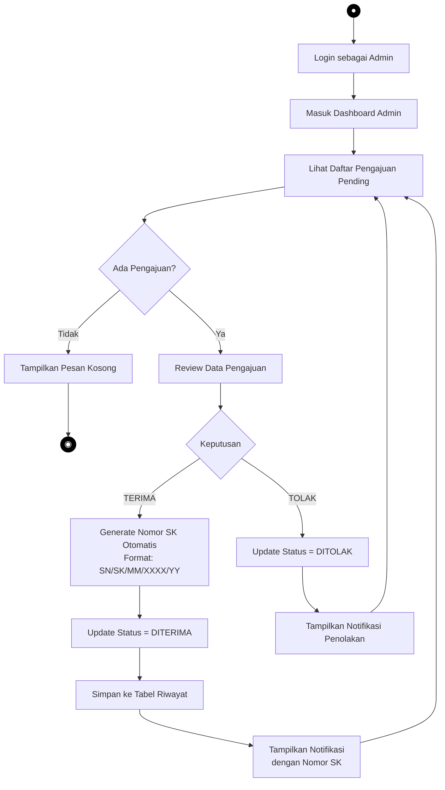
```mermaid
flowchart TD
    START((●)) --> A[Login sebagai Admin]
    A --> B[Masuk Dashboard Admin]
    B --> C[Lihat Daftar Pengajuan Pending]
    C --> D{Ada Pengajuan?}
    D -->|Tidak| E[Tampilkan Pesan Kosong]
    E --> FINISH((◉))
    D -->|Ya| F[Review Data Pengajuan]
    F --> G{Keputusan}
    G -->|TERIMA| H[Generate Nomor SK Otomatis<br/>Format: SN/SK/MM/XXXX/YY]
    H --> I[Update Status = DITERIMA]
    I --> J[Simpan ke Tabel Riwayat]
    J --> K[Tampilkan Notifikasi<br/>dengan Nomor SK]
    G -->|TOLAK| L[Update Status = DITOLAK]
    L --> M[Tampilkan Notifikasi Penolakan]
    K --> C
    M --> C

    style START fill:#000,stroke:#000,color:#fff
    style FINISH fill:#000,stroke:#000,color:#fff
```

```

</details>

---

## 🔀 Sequence Diagram

> 📎 **File:** [Sequence-Diagram.drawio](docs/diagrams/Sequence-Diagram.drawio) | [Sequence-Diagram.png](docs/diagrams/Sequence-Diagram.png)

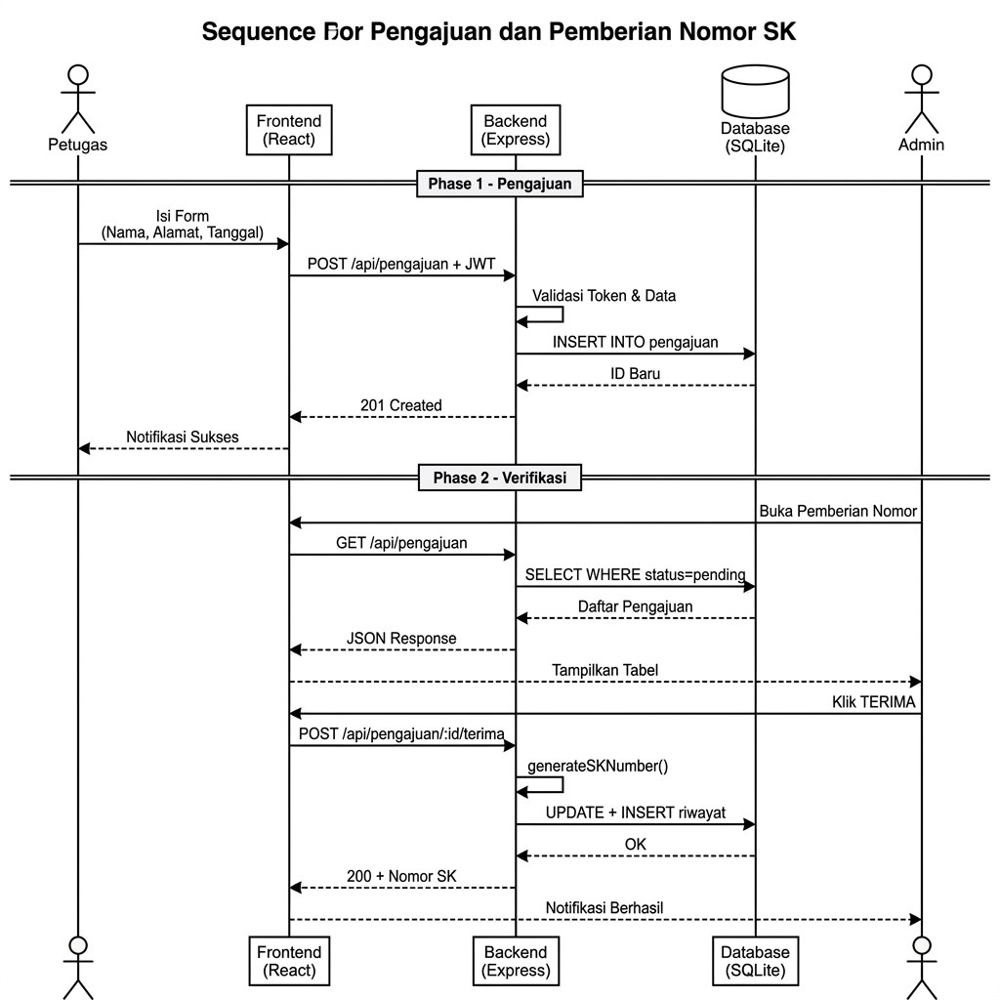

<details>
<summary>📐 Kode Mermaid</summary>

### Sequence Diagram — Proses Login

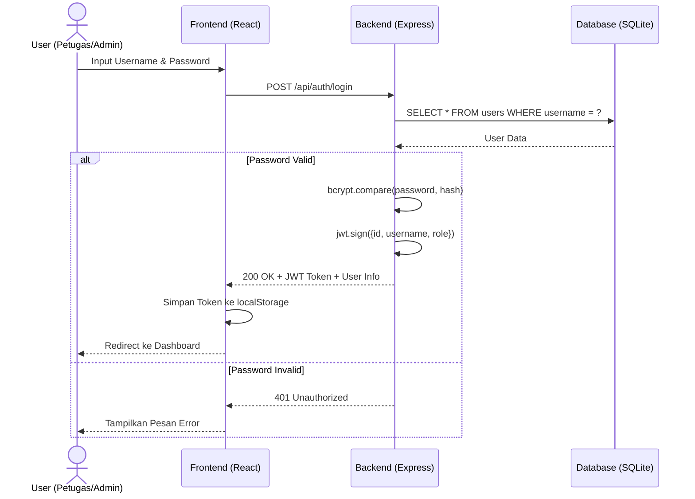
```mermaid
sequenceDiagram
    actor U as User (Petugas/Admin)
    participant FE as Frontend (React)
    participant BE as Backend (Express)
    participant DB as Database (SQLite)

    U->>FE: Input Username & Password
    FE->>BE: POST /api/auth/login
    BE->>DB: SELECT * FROM users WHERE username = ?
    DB-->>BE: User Data
    
    alt Password Valid
        BE->>BE: bcrypt.compare(password, hash)
        BE->>BE: jwt.sign({id, username, role})
        BE-->>FE: 200 OK + JWT Token + User Info
        FE->>FE: Simpan Token ke localStorage
        FE-->>U: Redirect ke Dashboard
    else Password Invalid
        BE-->>FE: 401 Unauthorized
        FE-->>U: Tampilkan Pesan Error
    end
```

### Sequence Diagram — Proses Pengajuan & Pemberian Nomor SK

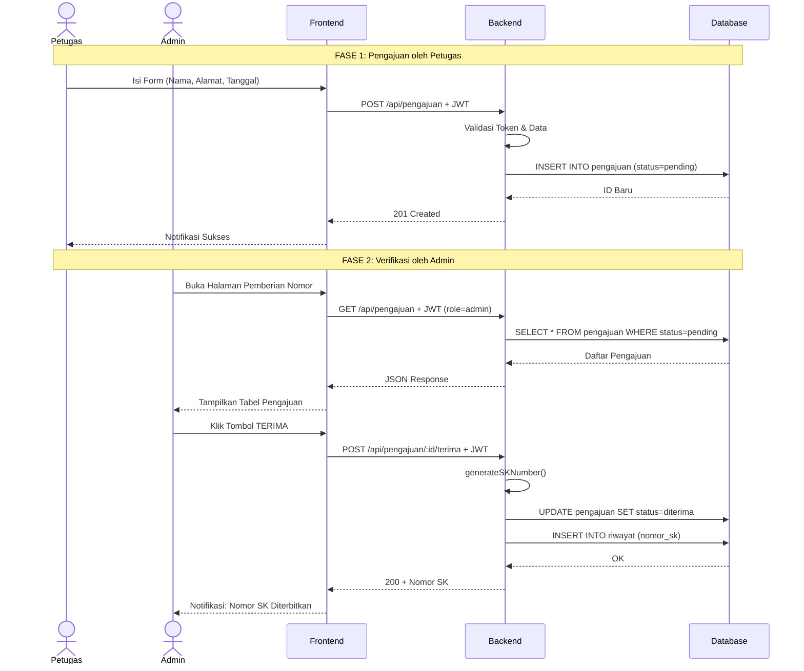
```mermaid
sequenceDiagram
    actor PT as Petugas
    actor AD as Admin
    participant FE as Frontend
    participant BE as Backend
    participant DB as Database

    Note over PT,DB: FASE 1: Pengajuan oleh Petugas
    
    PT->>FE: Isi Form (Nama, Alamat, Tanggal)
    FE->>BE: POST /api/pengajuan + JWT
    BE->>BE: Validasi Token & Data
    BE->>DB: INSERT INTO pengajuan (status=pending)
    DB-->>BE: ID Baru
    BE-->>FE: 201 Created
    FE-->>PT: Notifikasi Sukses

    Note over PT,DB: FASE 2: Verifikasi oleh Admin

    AD->>FE: Buka Halaman Pemberian Nomor
    FE->>BE: GET /api/pengajuan + JWT (role=admin)
    BE->>DB: SELECT * FROM pengajuan WHERE status=pending
    DB-->>BE: Daftar Pengajuan
    BE-->>FE: JSON Response
    FE-->>AD: Tampilkan Tabel Pengajuan

    AD->>FE: Klik Tombol TERIMA
    FE->>BE: POST /api/pengajuan/:id/terima + JWT
    BE->>BE: generateSKNumber()
    BE->>DB: UPDATE pengajuan SET status=diterima
    BE->>DB: INSERT INTO riwayat (nomor_sk)
    DB-->>BE: OK
    BE-->>FE: 200 + Nomor SK
    FE-->>AD: Notifikasi: Nomor SK Diterbitkan
```

```

</details>

---

## 🏛 Class Diagram

> 📎 **File:** [Class-Diagram.drawio](docs/diagrams/Class-Diagram.drawio) | [Class-Diagram.png](docs/diagrams/Class-Diagram.png)

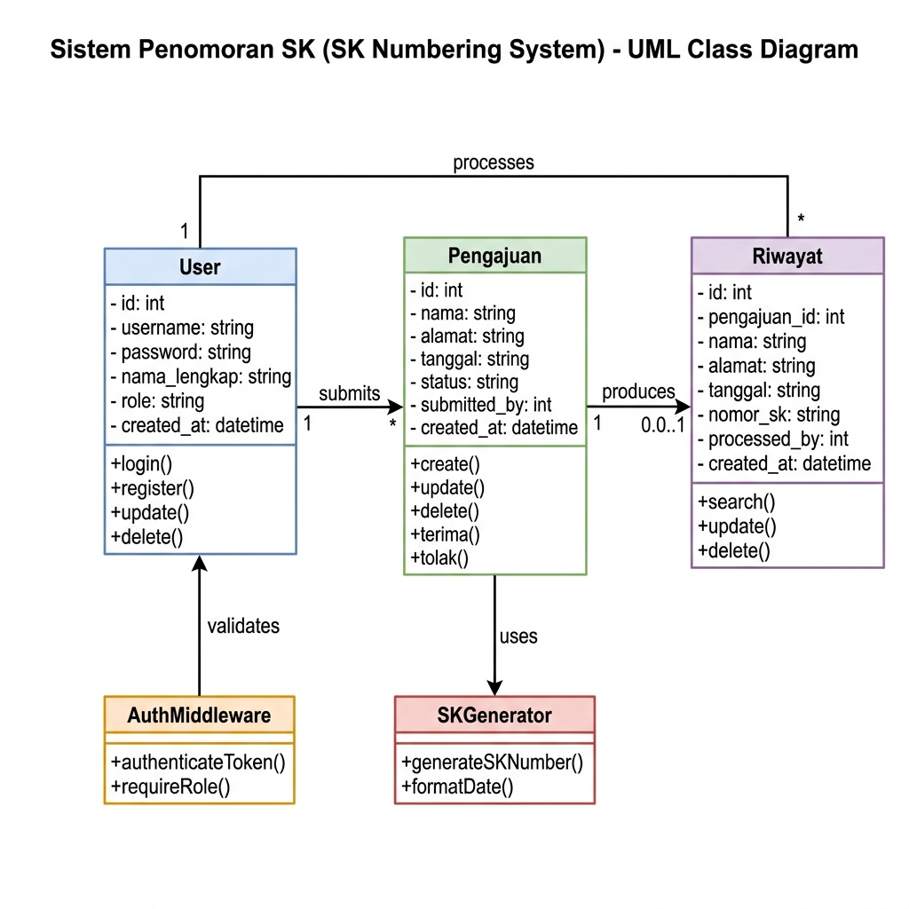

<details>
<summary>📐 Kode Mermaid</summary>

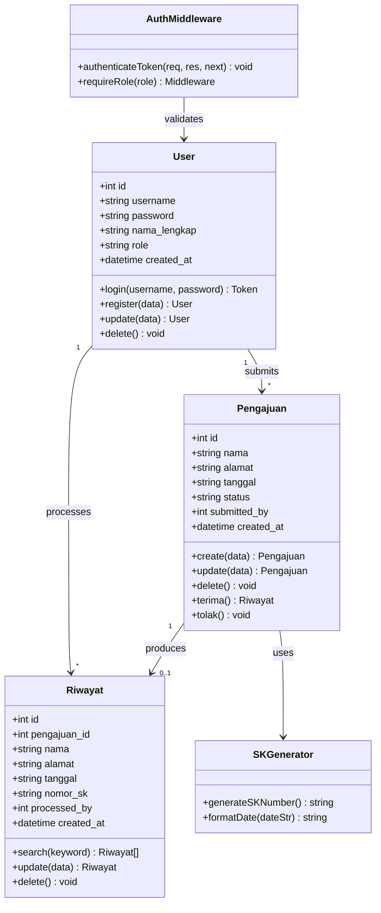
```mermaid
classDiagram
    class User {
        +int id
        +string username
        +string password
        +string nama_lengkap
        +string role
        +datetime created_at
        +login(username, password) Token
        +register(data) User
        +update(data) User
        +delete() void
    }

    class Pengajuan {
        +int id
        +string nama
        +string alamat
        +string tanggal
        +string status
        +int submitted_by
        +datetime created_at
        +create(data) Pengajuan
        +update(data) Pengajuan
        +delete() void
        +terima() Riwayat
        +tolak() void
    }

    class Riwayat {
        +int id
        +int pengajuan_id
        +string nama
        +string alamat
        +string tanggal
        +string nomor_sk
        +int processed_by
        +datetime created_at
        +search(keyword) Riwayat[]
        +update(data) Riwayat
        +delete() void
    }

    class AuthMiddleware {
        +authenticateToken(req, res, next) void
        +requireRole(role) Middleware
    }

    class SKGenerator {
        +generateSKNumber() string
        +formatDate(dateStr) string
    }

    User "1" --> "*" Pengajuan : submits
    User "1" --> "*" Riwayat : processes
    Pengajuan "1" --> "0..1" Riwayat : produces
    AuthMiddleware --> User : validates
    Pengajuan --> SKGenerator : uses
```

```

</details>

---

## 🔁 Flowchart Sistem

> 📎 **File:** [Flowchart-Sistem.png](docs/diagrams/Flowchart-Sistem.png)

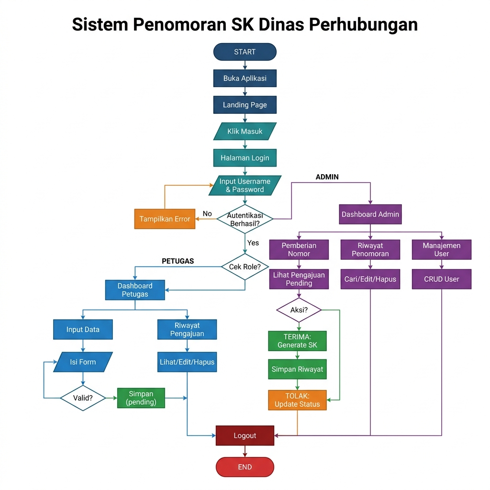

<details>
<summary>📐 Kode Mermaid</summary>

### Flowchart Utama Sistem

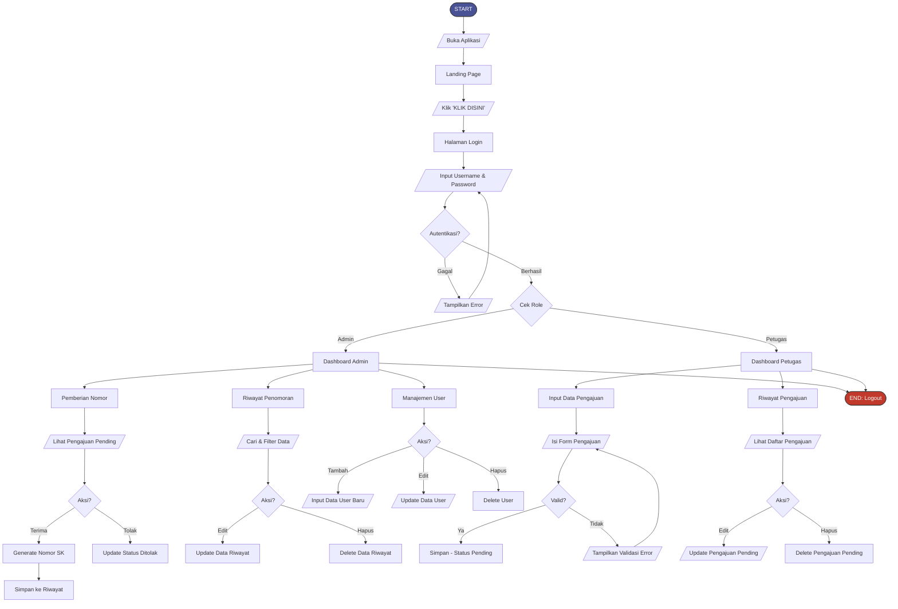
```mermaid
flowchart TD
    A([START]) --> B[/Buka Aplikasi/]
    B --> C[Landing Page]
    C --> D[/Klik 'KLIK DISINI'/]
    D --> E[Halaman Login]
    E --> F[/Input Username & Password/]
    F --> G{Autentikasi?}
    G -->|Gagal| H[/Tampilkan Error/]
    H --> F
    G -->|Berhasil| I{Cek Role}
    I -->|Admin| J[Dashboard Admin]
    I -->|Petugas| K[Dashboard Petugas]

    J --> J1[Pemberian Nomor]
    J --> J2[Riwayat Penomoran]
    J --> J3[Manajemen User]

    J1 --> J1A[/Lihat Pengajuan Pending/]
    J1A --> J1B{Aksi?}
    J1B -->|Terima| J1C[Generate Nomor SK]
    J1C --> J1D[Simpan ke Riwayat]
    J1B -->|Tolak| J1E[Update Status Ditolak]

    J2 --> J2A[/Cari & Filter Data/]
    J2A --> J2B{Aksi?}
    J2B -->|Edit| J2C[Update Data Riwayat]
    J2B -->|Hapus| J2D[Delete Data Riwayat]

    J3 --> J3A{Aksi?}
    J3A -->|Tambah| J3B[/Input Data User Baru/]
    J3A -->|Edit| J3C[/Update Data User/]
    J3A -->|Hapus| J3D[Delete User]

    K --> K1[Input Data Pengajuan]
    K --> K2[Riwayat Pengajuan]

    K1 --> K1A[/Isi Form Pengajuan/]
    K1A --> K1B{Valid?}
    K1B -->|Ya| K1C[Simpan - Status Pending]
    K1B -->|Tidak| K1D[/Tampilkan Validasi Error/]
    K1D --> K1A

    K2 --> K2A[/Lihat Daftar Pengajuan/]
    K2A --> K2B{Aksi?}
    K2B -->|Edit| K2C[/Update Pengajuan Pending/]
    K2B -->|Hapus| K2D[Delete Pengajuan Pending]

    A2([END: Logout]) 
    J --> A2
    K --> A2

    style A fill:#4a5296,stroke:#333,color:#fff
    style A2 fill:#c0392b,stroke:#333,color:#fff
```

</details>

---

## 🗃 Struktur Database

### Tabel `users`

| Kolom | Tipe | Constraint | Keterangan |
|---|---|---|---|
| `id` | INTEGER | PRIMARY KEY, AUTOINCREMENT | ID unik user |
| `username` | TEXT | UNIQUE, NOT NULL | Username untuk login |
| `password` | TEXT | NOT NULL | Password (bcrypt hash) |
| `nama_lengkap` | TEXT | NOT NULL | Nama lengkap user |
| `role` | TEXT | CHECK (admin/petugas) | Peran akses |
| `created_at` | DATETIME | DEFAULT CURRENT_TIMESTAMP | Waktu registrasi |

### Tabel `pengajuan`

| Kolom | Tipe | Constraint | Keterangan |
|---|---|---|---|
| `id` | INTEGER | PRIMARY KEY, AUTOINCREMENT | ID pengajuan |
| `nama` | TEXT | NOT NULL | Nama lokasi/desa |
| `alamat` | TEXT | NOT NULL | Alamat lengkap |
| `tanggal` | TEXT | NOT NULL | Tanggal pengajuan (DD-MM-YYYY) |
| `status` | TEXT | CHECK (pending/diterima/ditolak) | Status verifikasi |
| `submitted_by` | INTEGER | FOREIGN KEY → users(id) | ID petugas pengaju |
| `created_at` | DATETIME | DEFAULT CURRENT_TIMESTAMP | Waktu dibuat |

### Tabel `riwayat`

| Kolom | Tipe | Constraint | Keterangan |
|---|---|---|---|
| `id` | INTEGER | PRIMARY KEY, AUTOINCREMENT | ID riwayat |
| `pengajuan_id` | INTEGER | FOREIGN KEY → pengajuan(id) | Referensi pengajuan |
| `nama` | TEXT | NOT NULL | Nama lokasi/desa |
| `alamat` | TEXT | NOT NULL | Alamat lengkap |
| `tanggal` | TEXT | NOT NULL | Tanggal |
| `nomor_sk` | TEXT | NOT NULL | Nomor SK yang diterbitkan |
| `processed_by` | INTEGER | FOREIGN KEY → users(id) | ID admin pemroses |
| `created_at` | DATETIME | DEFAULT CURRENT_TIMESTAMP | Waktu diproses |

---

## 🌐 API Endpoint

### Autentikasi

| Method | Endpoint | Auth | Deskripsi |
|---|---|---|---|
| `POST` | `/api/auth/login` | ❌ | Login dan dapatkan JWT token |
| `GET` | `/api/auth/me` | ✅ | Verifikasi session dan ambil user data |

### Pengajuan

| Method | Endpoint | Auth | Role | Deskripsi |
|---|---|---|---|---|
| `GET` | `/api/pengajuan` | ✅ | All | Daftar pengajuan (admin: semua pending, petugas: milik sendiri) |
| `POST` | `/api/pengajuan` | ✅ | All | Buat pengajuan baru |
| `PUT` | `/api/pengajuan/:id` | ✅ | All | Edit pengajuan (hanya status pending) |
| `DELETE` | `/api/pengajuan/:id` | ✅ | All | Hapus pengajuan |
| `POST` | `/api/pengajuan/:id/terima` | ✅ | Admin | Terima pengajuan → generate nomor SK |
| `POST` | `/api/pengajuan/:id/tolak` | ✅ | Admin | Tolak pengajuan |

### Riwayat

| Method | Endpoint | Auth | Role | Deskripsi |
|---|---|---|---|---|
| `GET` | `/api/riwayat` | ✅ | Admin | Daftar semua riwayat SK (+ search & pagination) |
| `PUT` | `/api/riwayat/:id` | ✅ | Admin | Edit data riwayat |
| `DELETE` | `/api/riwayat/:id` | ✅ | Admin | Hapus data riwayat |

### Manajemen User

| Method | Endpoint | Auth | Role | Deskripsi |
|---|---|---|---|---|
| `GET` | `/api/users` | ✅ | Admin | Daftar semua user |
| `POST` | `/api/users` | ✅ | Admin | Tambah user baru |
| `PUT` | `/api/users/:id` | ✅ | Admin | Update data user |
| `DELETE` | `/api/users/:id` | ✅ | Admin | Hapus user |

---

## 📁 Struktur Direktori

```
sistem-penomoran-sk/
├── public/
│   ├── favicon.svg              # Favicon
│   ├── icons.svg                # SVG sprite icons
│   └── logo-dishub.png          # Logo Dinas Perhubungan
│
├── server/                      # === BACKEND ===
│   ├── index.js                 # Entry point Express server
│   ├── database.js              # Konfigurasi SQLite & seed data
│   ├── middleware/
│   │   └── auth.js              # JWT authentication middleware
│   └── routes/
│       ├── auth.js              # Login & session endpoints
│       ├── users.js             # CRUD user management
│       ├── pengajuan.js         # CRUD pengajuan + terima/tolak
│       └── riwayat.js           # CRUD riwayat SK + search
│
├── src/                         # === FRONTEND ===
│   ├── main.jsx                 # React entry point
│   ├── App.jsx                  # Router & protected routes
│   ├── index.css                # Global styles & design system
│   ├── context/
│   │   ├── AuthContext.jsx      # JWT auth state management
│   │   └── DataContext.jsx      # Toast notification context
│   ├── components/
│   │   ├── Layout.jsx           # Dashboard layout wrapper
│   │   ├── Sidebar.jsx          # Navigation sidebar
│   │   └── Sidebar.css          # Sidebar styles
│   └── pages/
│       ├── Landing.jsx          # Landing page
│       ├── Login.jsx            # Login form
│       ├── Auth.css             # Auth pages styles
│       ├── admin/
│       │   ├── PemberianNomor.jsx  # Verifikasi pengajuan
│       │   ├── Riwayat.jsx         # Riwayat penomoran SK
│       │   └── ManajemenUser.jsx   # Kelola user
│       └── petugas/
│           ├── InputData.jsx       # Form pengajuan baru
│           └── Riwayat.jsx         # Riwayat pengajuan
│
├── index.html                   # HTML entry point
├── package.json                 # Dependencies & scripts
├── vite.config.js               # Vite config + proxy
└── README.md                    # Dokumentasi ini
```

---

## 🚀 Cara Instalasi & Menjalankan

### Prasyarat

- **Node.js** versi 18 atau lebih baru
- **npm** (terinstall bersama Node.js)

### Langkah Instalasi

```bash
# 1. Clone atau extract project
cd sistem-penomoran-sk

# 2. Install semua dependencies
npm install

# 3. Jalankan aplikasi (frontend + backend)
npm run dev:full
```

### Akses Aplikasi

Setelah berhasil dijalankan:

| Service | URL |
|---|---|
| **Frontend** | [http://localhost:5173](http://localhost:5173) |
| **Backend API** | [http://localhost:3001](http://localhost:3001) |

### Akun Default

| Role | Username | Password |
|---|---|---|
| Admin | `admin` | `admin123` |
| Petugas | `petugas` | `petugas123` |

### Scripts yang Tersedia

```bash
npm run dev        # Jalankan frontend saja
npm run server     # Jalankan backend saja
npm run dev:full   # Jalankan keduanya bersamaan
npm run build      # Build production frontend
```

---

## 📸 Screenshot Aplikasi

### Halaman Landing
Tampilan awal aplikasi dengan logo Dinas Perhubungan dan tagline utama.

### Halaman Login
Form login dengan autentikasi JWT. Tersedia untuk Admin dan Petugas.

### Dashboard Admin — Pemberian Nomor
Admin dapat melihat daftar pengajuan pending dari petugas, lalu memilih untuk **menerima** (auto-generate nomor SK) atau **menolak** pengajuan.

### Dashboard Admin — Riwayat Penomoran
Tabel riwayat semua SK yang telah diproses dengan fitur pencarian, edit, dan hapus.

### Dashboard Admin — Manajemen User
Halaman khusus admin untuk mengelola akun pengguna (tambah, edit, hapus).

### Dashboard Petugas — Input Data
Form pengajuan baru dengan field: Nama, Alamat, dan Tanggal.

### Dashboard Petugas — Riwayat Pengajuan
Daftar pengajuan petugas dengan status (Pending/Diterima/Ditolak).

---

## 📝 Lisensi

Proyek ini dibuat untuk keperluan tugas akademik di lingkungan **Dinas Perhubungan Kabupaten Gianyar**.

---

<p align="center">
  <strong>Dinas Perhubungan Kabupaten Gianyar</strong><br/>
  Sistem Penomoran Surat Keputusan &copy; 2025
</p>
